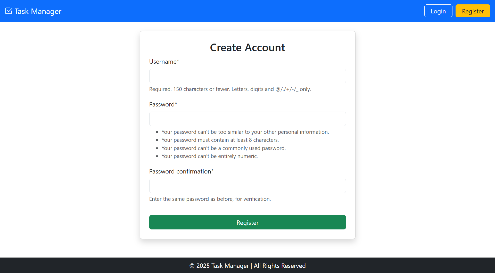
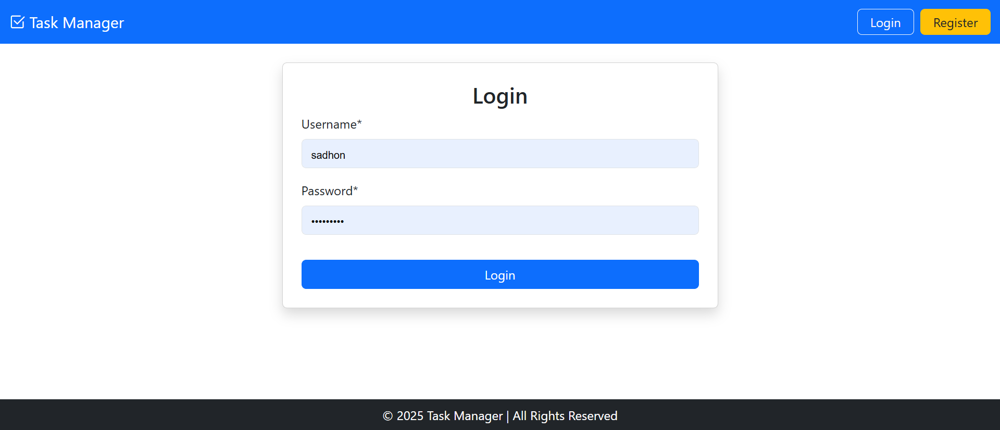
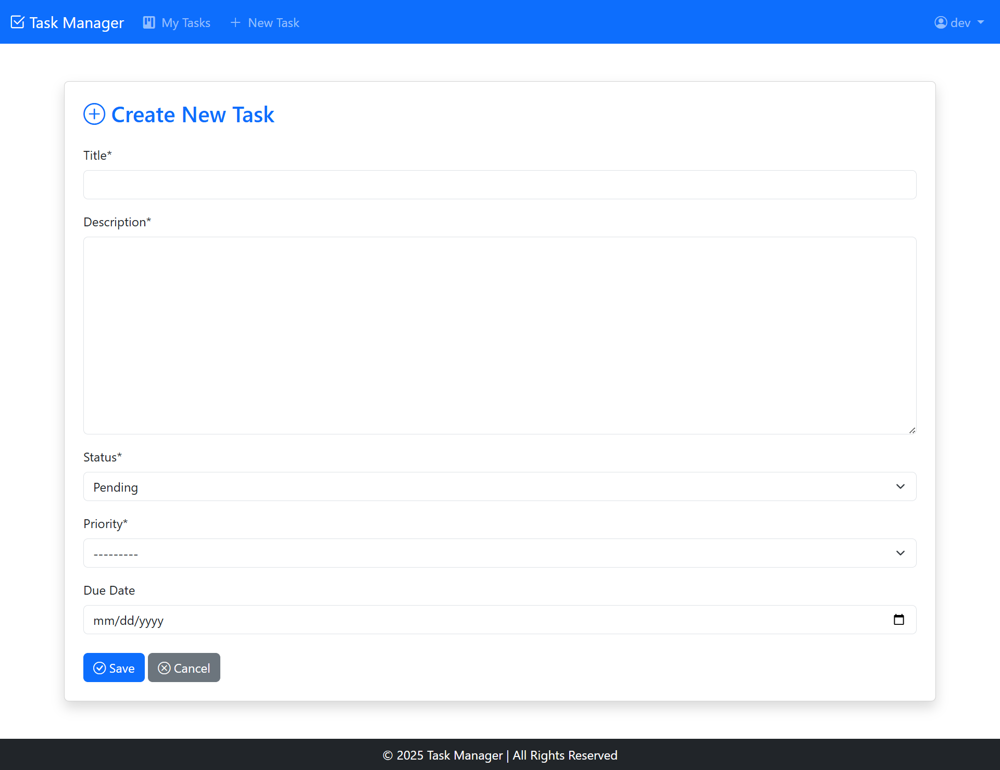
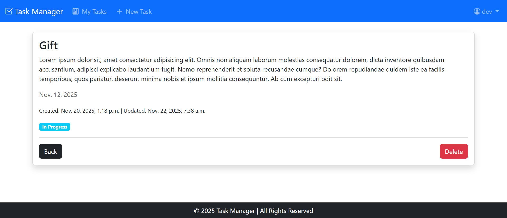
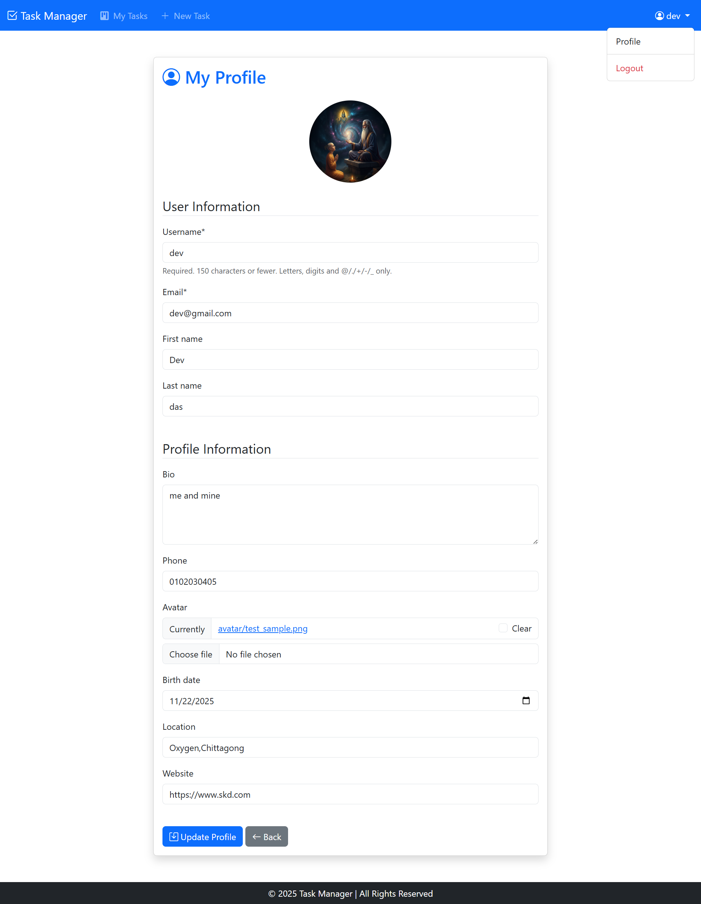

# Task Manager Application

A Django-based web application for managing personal tasks with advanced filtering, searching, and sorting capabilities.

## 📋 Table of Contents
- [Problem Statement](#problem-statement)
- [Features](#features)
- [Prerequisites](#prerequisites)
- [Installation & Setup](#installation--setup)
- [Project Structure](#project-structure)
- [Usage](#usage)
- [Screenshots](#screenshots)
- [Technologies Used](#technologies-used)
- [Contributing](#contributing)
- [License](#license)

---

## 🎯 Problem Statement

In today's fast-paced world, managing daily tasks efficiently is crucial for productivity. This Task Manager application solves the problem of task organization by providing a centralized platform where users can:

- Create and manage personal tasks
- Track task completion status
- Prioritize tasks based on urgency
- Filter and search through tasks quickly
- Monitor progress with completed vs pending task statistics

The application ensures that each user has a private workspace where they can organize their tasks without interference, making it ideal for personal productivity or small team task management.

---

## ✨ Features

- **🔐 User Authentication**: Secure login system - users only see their own tasks
- **📝 Task CRUD Operations**: Create, Read, Update, and Delete tasks
- **🔍 Advanced Search**: Search tasks by title or description
- **🎛️ Multi-level Filtering**:
  - Filter by status (pending, in_progress, complete)
  - Filter by priority levels
  - Filter by due date
- **📊 Sorting Options**: Sort tasks by newest or oldest
- **📈 Task Statistics**: Real-time count of completed and pending tasks
- **👤 User-specific Tasks**: Each user has their own isolated task list
- **📱 Responsive Design**: Works seamlessly across devices

---

## 🔧 Prerequisites

Before you begin, ensure you have the following installed:

- **Python** 3.8 or higher
- **pip** (Python package manager)
- **Git** (for cloning the repository)
- **Virtual Environment** (recommended)

---

## 🚀 Installation & Setup

### 1. Clone the Repository

```bash
git clone https://github.com/yourusername/task-manager.git
cd TASK MANAGER
```

### 2. Create Virtual Environment

**Windows:**
```bash
python -m venv env
env\Scripts\activate
```

**macOS/Linux:**
```bash
python3 -m venv env
source env/bin/activate
```

### 3. Install Dependencies

```bash
pip install -r requirements.txt
```

The `requirements.txt` should contain:
```
Django>=4.2
```

### 4. Database Setup

Apply migrations to create the database:

```bash
python manage.py makemigrations
python manage.py migrate
```

### 5. Create Superuser (Admin)

```bash
python manage.py createsuperuser
```

Follow the prompts to create your admin account.

### 6. Run Development Server

```bash
python manage.py runserver
```

### 7. Access the Application

Open your browser and navigate to:
```
http://127.0.0.1:8000/
```

---

## 📁 Project Structure

```
TASK MANAGER/
│
├── taskmanager/              # Main project folder
│   ├── avatar/              # User avatar files
│   ├── taskmanager/         # Project configuration
│   │   ├── __init__.py
│   │   ├── settings.py      # Project settings
│   │   ├── urls.py          # Main URL configuration
│   │   ├── wsgi.py
│   │   └── asgi.py
│   │
│   ├── tasks/               # Tasks application
│   │   ├── migrations/
│   │   ├── models.py        # Task model definitions
│   │   ├── views.py         # View functions (ViewTaskList, etc.)
│   │   ├── urls.py          # App URL patterns
│   │   ├── forms.py         # Task forms
│   │   └── admin.py         # Admin configuration
│   │
│   ├── templates/           # HTML templates
│   │   ├── tasklist.html
│   │   ├── task_detail.html
│   │   ├── task_form.html
│   │   └── base.html
│   │
│   ├── static/              # Static files (CSS, JS, images)
│   │
│   ├── db.sqlite3           # SQLite database
│   ├── manage.py            # Django management script
│   └── requirements.txt     # Python dependencies
│
├── README.md                # This file
└── .gitignore              # Git ignore file
```

---

## 💡 Usage

### Creating a Task

1. Click on "Create Task" or "Add New Task" button
2. Fill in the task details:
   - Title
   - Description
   - Priority (low, medium, high)
   - Due Date
   - Status (pending, in_progress, complete)
3. Click "Save" to create the task

### Filtering Tasks

Use the filter panel to narrow down your task list:

- **Status Filter**: Show only pending, in-progress, or completed tasks
- **Priority Filter**: Filter by task priority level
- **Due Date Filter**: View tasks by specific due dates
- **Search Bar**: Enter keywords to search in task titles and descriptions

### Sorting Tasks

- **Newest First**: Default view (most recently created tasks appear first)
- **Oldest First**: Shows older tasks at the top

### Updating Tasks

1. Click on a task to view details
2. Click "Edit" button
3. Modify task information
4. Save changes

### Deleting Tasks

1. Navigate to task details
2. Click "Delete" button
3. Confirm deletion

---

## 📸 Screenshots

### 1. Task List Dashboard

*Main dashboard displaying all tasks with filtering and search options*

### 2. Task Filters in Action

*Filter panel showing status, priority, and due date filtering options*

### 3. Search Functionality

*Search results displaying tasks matching the search query*

### 4. Task Statistics

*Overview showing completed tasks vs pending tasks count*

### 5. Create New Task

*Form interface for creating a new task*

### 6. Task Detail View

*Detailed view of a single task with edit and delete options*

---

## 🛠️ Technologies Used

- **Backend Framework**: Django 4.x
- **Database**: SQLite3 (default, can be changed to PostgreSQL/MySQL)
- **Frontend**: HTML5, CSS3, Bootstrap (if applicable)
- **Authentication**: Django built-in authentication system
- **ORM**: Django ORM

---

## 🐛 Known Issues & Fixes

### Bug Fix: Search Filter Typo
The original code had a typo in the search filter:

```python
# ❌ Wrong (typo)
tasks.filter(title__icontainns = search_filter)

# ✅ Correct
tasks.filter(title__icontains = search_filter)
```

Task Management System (Django)

Overview
-
This repository contains a Django project that implements a user-specific Task Management System. It provides user registration, login/logout, per-user task CRUD (create, read, update, delete), filtering, sorting, and search.

Problem Statement
-
Build a Task Management System using Django with the following requirements:

- **User Authentication & Authorization**: Registration, login, and logout using Django’s auth system. Only authenticated users can access the task dashboard. Each user sees only their own tasks and cannot access, edit, or delete others' tasks.
- **Task Management (CRUD)**: A `Task` model with the fields: `title`, `description`, `status` (Pending/In Progress/Completed), `priority` (Low/Medium/High), `created_at`, `updated_at`, `due_date`, and `owner` (ForeignKey to `User`). Implement Create, Read (list & detail), Update and Delete operations.
- **Task Viewing & Filtering**: Task list page supports filters via query parameters for `status`, `priority`, `due date` (Today / This Week / Overdue), and sorting by newest/oldest. Example: `/tasks/?status=pending&priority=high&sort=newest`.
- **Task Details Page**: Full description, timestamps, due date, and status. Only owners can access this page.
- **Task Search**: Search by task title and description via query parameter `search`. Example: `/tasks/?search=meeting`.
- **Task Deletion**: Delete tasks from list view or detail view with confirmation.

Project structure
-
- `taskmanager/` — Django project root
- `tasks/` — Django app containing models, views, templates, and urls
- `env/` — virtual environment (not committed; shown here for convenience)
- `db.sqlite3` — SQLite database used for development

Setup (Windows / PowerShell)
-
1. Create and activate virtual environment (if not already created):

```powershell
python -m venv env
.\env\Scripts\Activate.ps1
```

2. Install dependencies:

```powershell
pip install -r requirements.txt
```

3. Apply migrations:

```powershell
python manage.py migrate
```

4. (Optional) Create a superuser:

```powershell
python manage.py createsuperuser
```

5. Run the development server:

```powershell
python manage.py runserver
```

Access the app at `http://127.0.0.1:8000/`.

Usage
-
- Register a new user (or login using existing credentials).
- After login, open the Tasks dashboard to create, filter, search, edit, and delete your tasks.
- Example filter/search URL:

```
/tasks/?status=pending&priority=high&due=overdue&sort=newest&search=meeting
```

Implementation notes
-
- Authentication: Uses Django's built-in `django.contrib.auth` views/forms for registration and login if included in the app. Ensure views are protected using `@login_required` or `LoginRequiredMixin`.
- Task ownership: Access to detail, update and delete views checks that `request.user == task.owner` and returns `HttpResponseForbidden` or raises `Http404` if not allowed.
- Filtering & search: Implemented in the tasks list view by reading query parameters (`status`, `priority`, `due`, `sort`, `search`) and applying filters using Django ORM lookups.
- Due date filters:
  - `today`: `due_date == timezone.localdate()`
  - `this_week`: `due_date` within start/end of current week
  - `overdue`: `due_date < timezone.localdate()` and status != Completed

Templates
-
- `tasks/templates/` contains templates for `tasklist.html`, `task_details.html`, `create_task.html`, `update_task.html`, `confirm_delete.html`, `login.html`, `register.html`, `profile.html`.
- Add a search form and filter controls in `tasklist.html`. When a delete action is triggered, show a confirmation page (`confirm_delete.html`) or a JS confirmation prompt.

Security & Access Control
-
- All task views are restricted to authenticated users. Use `LoginRequiredMixin` on class-based views or `@login_required` on function views.
- Verify ownership on detail/update/delete views; avoid exposing primary key-only lookups without ownership checks.

Bonus (Optional)
-
- A user profile page can be added at `/profile/` to show user details and allow profile edits. See `tasks/templates/profile.html`.

Troubleshooting
-
- If templates aren't loading, confirm `TEMPLATES['DIRS']` in `taskmanager/settings.py` includes the project `templates` directory.
- If static files fail in development, run `python manage.py collectstatic` only if `DEBUG=False`.

Next steps
-
- If you'd like, I can:
  - Walk through and verify ownership checks in view functions/classes.
  - Add or improve unit tests for main Task views.
  - Add AJAX search/filtering for a smoother UI.

Contact
-
If you want me to update the README further or incorporate screenshots and example data, tell me what to include and I'll update the file.

### Screenshort








